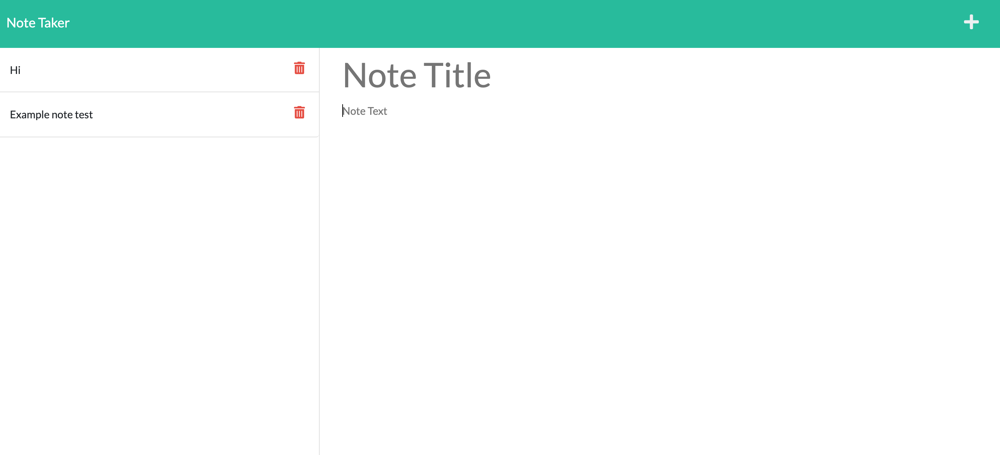

# Note Taker Starter Code# Note-Taker-UCLA-Challenge-11
An application that can be used to write, save, and delete notes. This application will use an express backend and save and retrieve note data from a JSON file.

# Tech Used
js, node, express, npm modules